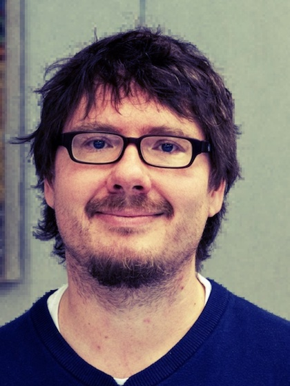

## About
{style="float:right;padding:5px;border: 1px solid #ccc;width:200px; margin-left:2em;"}

I am a professor of [Computational Communication Science](https://ccs.ifp.uni-mainz.de) at the [Department of Communication](https://www.ifp.uni-mainz.de), [Johannes Gutenberg University Mainz](https://www.uni-mainz.de). My main research interests are online communication, media use and effects, and quantitative methods, especially automatic data collection and statistical modeling. 

[Curriculum Vitae](/cv) ([PDF](/cv/cv-mscharkow.pdf)) | [Google Scholar](https://scholar.google.com/citations?user=MKN8lkMAAAAJ&hl=en) 

### Contact

Johannes-Gutenberg University Mainz  
Department of Communication  
Jakob-Welder-Weg 12  
55128 Mainz  
Germany

<scharkow@uni-mainz.de>

## Research

:::{#research}
:::

## Teaching

:::{#teaching}
:::

